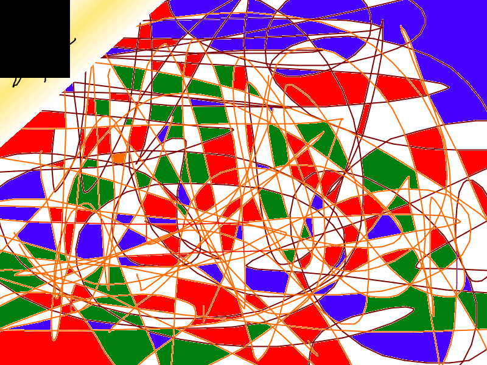

# BasicImageProcessingLib
Basic level some image processing function with C++ and 24 bit BMP file

# Sources repository

I get read and write functions in this repo https://github.com/yvznvr/ImageProcessing

# Original image repository

# Zoom in image repository

